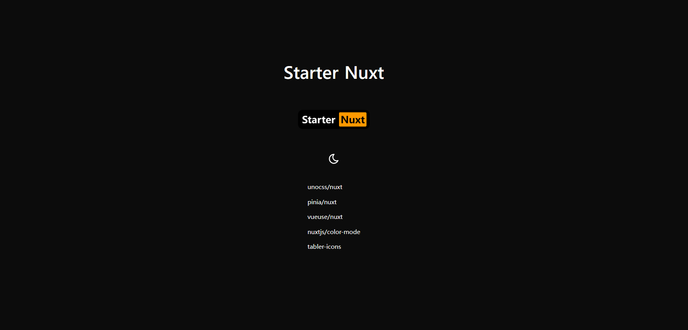

<h1 align=center>Starter Nuxt</h1>

<p align=center >
	
</p>

```sh
git clone https://github.com/zhaogongchengsi/starter-nuxt.git my-app
```

## Features

- [💚 Nuxt 3](https://nuxt.com/) - SSR, ESR, File-based routing, components auto importing, modules, etc.

- 🎨 [UnoCSS](https://github.com/antfu/unocss) - The instant on-demand atomic CSS engine.

### Modules

- [✨ `unocss/nuxt`](https://unocss.dev/integrations/nuxt)
- [🎉 `pinia/nuxt`](https://nuxt.com/modules/pinia)
- [🎃 `vueuse/nuxt`](https://vueuse.org/guide/)
- [🎆 `nuxtjs/color-mode`](https://color-mode.nuxtjs.org/)
- [🎨 `tabler-icons`](https://tabler-icons.io/)